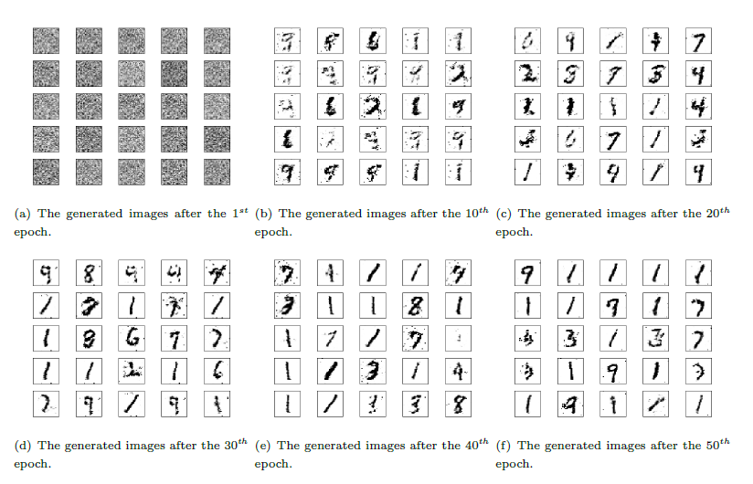
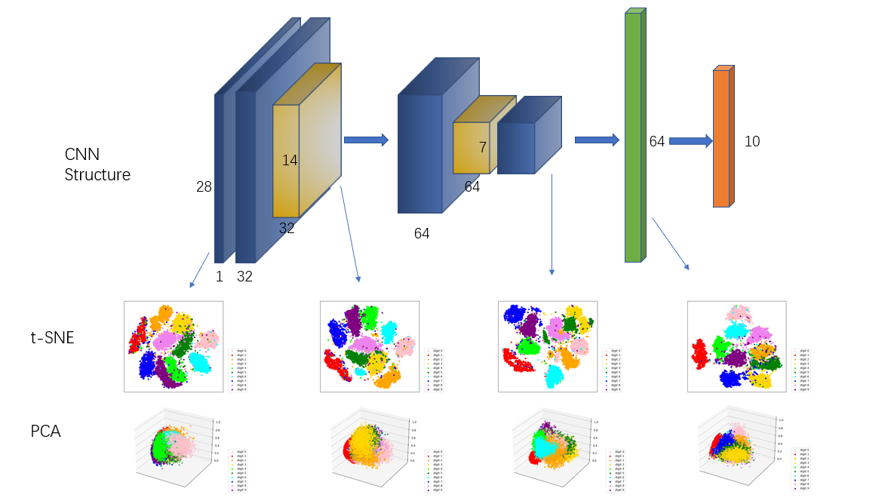
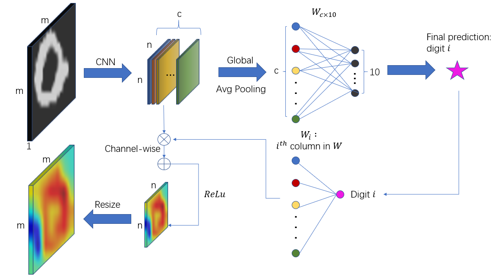
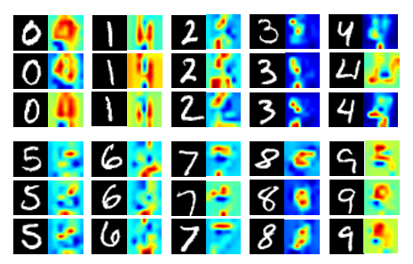

# CS385 MNIST Project

## Introduction

This is about the first project in SJTU CS385, Machine Learning.

We do the task of classifying [Mnist](http://yann.lecun.com/exdb/mnist/) dataset, which includes hand-written digits. There are 60,000 training samples and 10,000 test samples.

## Traditional Methods

The following are the traditional (not CNN-based) methods that I have implemented personally. Note that the Support Vector Machine method is implemented using [sklearn.svm](http://scikit-learn.org/stable/modules/generated/sklearn.svm.SVC.html) package.

* Logistic Regression
* Linear Discriminant Analysis
* Support Vector Machine
* Logistic Regression with Ridge Loss
* Logistic Regression with Lasso Loss
* Kernel-based Logistic Regression with Ridge Loss
* Kernel-based Logistic Regression with Lasso Loss

## CNN Architecture

The following are CNN architectures that I have implemented using [pytorch](https://pytorch.org) package.

* VGG11
* NaiveNet (which consists of 2 conv layers and two fc layers)
* VeryNaiveNet (which consists of 2 conv layers, with global pooling and an fc layer)
* LinearNet (which only consists of 1 linear layer)
* ResNet18

## Performance

For the limit of space, I only show the final 10-category results here, and omit per-category accuracy in traditional methods. 

Method | Accuracy | remark
:--: | :--: | :--:
Logistic Regression | 0.8821 | Initial
Logistic Regression | 0.8836 | Ridge loss
Logistic Regression | 0.8890 | Lasso loss
Logistic Regression | 0.8802 | Lasso + batch
Kernel Regression | 0.8312 | Ridge + RBF
Kernel Regression | 0.6062 | Ridge + COS
Kernel Regression | 0.8062 | Lasso + RBF
Kernel Regression | 0.5687 | Lasso + COS
LDA | 0.8080 | \
SVM | 0.8880 | Linear
SVM | 0.9380 | RBF
SVM | 0.9250 | Poly
SVM | 0.832 | Sigmoid
LinearNet | 0.9149 | \
VeryNaiveNet | 0.9845 | \
NaiveNet | 0.9910 | \
VGG11 | 0.9935 | \
ResNet18 | 0.9959 | \

## Generative Adversarial Network

## Feature visualization and Grad-CAM

### Structure of VeryNaiveNet with Feature Visualization

### The data flow of GradCAM

### Some GradCAM results

## Experiments

### Kernel logistic regression with dierent number of samples

### The bias term in LDA

### The full potential in CNN

* Partition an image into some blocks (4 x 4 in report), and random shuffle these blocks.
* For each pixel, concate its x and y coordinates to the image's 2nd and 3rd channel, so that the input images are 3-channel.